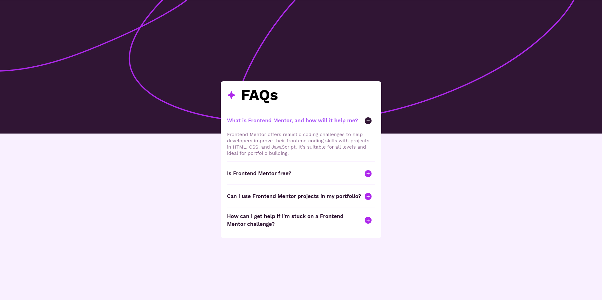

# Frontend Mentor - {Challenge name}

This is a solution to [challenge name]()

## Table of contents

- [Overview](#overview)
    - [Screenshot](#screenshots)
    - [Links](#links)
- [My process](#my-process)
    - [Built with](#built-with)
    - [What I learned](#what-i-learned)
    - [Useful resources](#useful-resources)

## Overview

### Screenshots




### Links

[Live preview](https://moutafatin.github.io/frontendmentor-faq-accordion)

### My process

#### Built with

- ReactJs
- Tailwind CSS
- Custom animation
- Semantic HTML
- Flexbox...

#### What I learned

I learned how to use useEffect and useRef.
I used them to get the accordion content height and set it to a CSS variable for animation.

```ts
const ref = useRef<HTMLDivElement>(null);

useEffect(() => {
  document.documentElement.style.setProperty(
    "--accordion-height",
    `${ref.current?.scrollHeight}px`,
  );
}, [open]);
```

